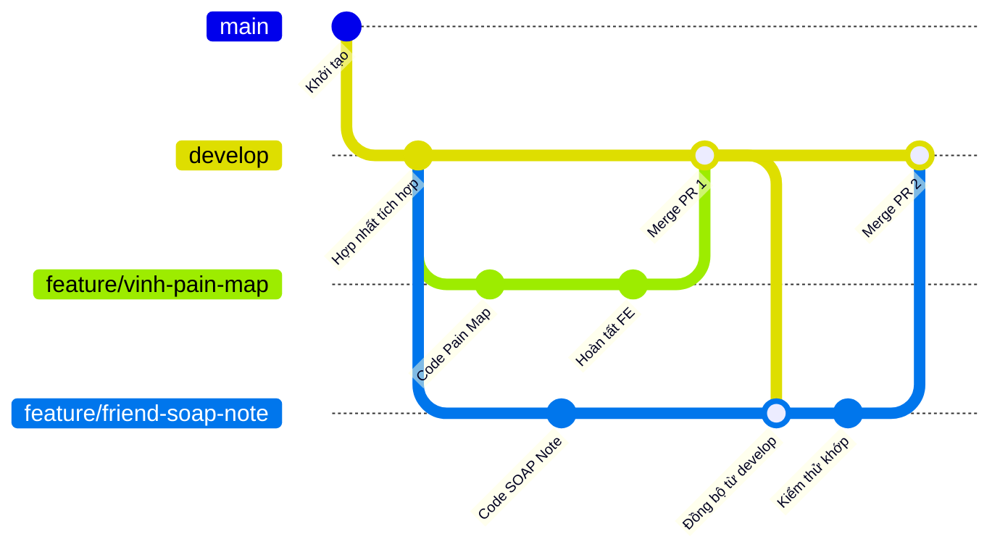

# CẨM NANG QUY TRÌNH PHỐI HỢP NHÓM & TRÁNH XUNG ĐỘT HỆ THỐNG - OFFICE CARE

> [!IMPORTANT]
> **TÀI LIỆU QUY CHUẨN VẬN HÀNH VÀ PHÁT TRIỂN DÀNH CHO CẢ ĐỘI NGŨ.**
> Tài liệu này thiết lập các quy tắc vàng về quản lý mã nguồn (Git), cơ sở dữ liệu (Database Schema), và phối hợp lập trình với AI Agent để đảm bảo toàn đội ngũ phát triển trơn tru, tuyệt đối không bị giẫm chân lên nhau hay gây lỗi xung đột hệ thống.

---

## 1. QUY TRÌNH QUẢN LÝ MÃ NGUỒN GIT (GIT BRANCHING STRATEGY)

Để tránh tình trạng nhiều lập trình viên cùng sửa đổi chung một tệp tin dẫn đến xung đột Git (Merge Conflicts) nghiêm trọng, toàn đội ngũ áp dụng mô hình **Git Feature Branching** tinh gọn dưới đây:

### 1.1 Sơ đồ phân nhánh Git chuyên nghiệp


### 1.2 Nguyên tắc phân phối nhánh:
1.  **Nhánh `main` / `master` (Production):** 
    *   *Trạng thái:* Luôn luôn ổn định 100%, chỉ chứa code đã qua kiểm thử nghiệm thu cuối cùng và sẵn sàng deploy lên máy chủ thực tế.
    *   *Ràng buộc:* Tuyệt đối không ai được phép commit hay push trực tiếp lên nhánh này.
2.  **Nhánh `develop` hoặc nhánh tích hợp chung (ví dụ: `feature/simplified-booking`):**
    *   *Trạng thái:* Nơi hội quân của cả nhóm để kiểm thử tích hợp các module.
3.  **Nhánh tính năng cá nhân (`feature/tên-thành-viên-tên-chức-năng`):**
    *   Mỗi khi bắt đầu một Task mới, lập trình viên bắt buộc phải rẽ nhánh mới từ nhánh chung mới nhất.
    *   *Ví dụ cụ thể:*
        *   `feature/vinh-pain-mapping` (Vinh làm giao diện biểu đồ điểm đau).
        *   `feature/nam-soap-voice` (Nam làm API ghi SOAP Note bằng giọng nói).

### 1.3 Quy trình 5 bước Merge Code tránh xung đột (Conflict Resolution Workflow):
Trước khi gộp code của bạn vào nhánh chung, hãy thực hiện nghiêm ngặt quy trình sau tại máy của bạn (Local):

```
[Hoàn tất code ở nhánh cá nhân]
             ➔
[Chuyển sang nhánh chung, chạy `git pull` mới nhất]
             ➔
[Quay lại nhánh cá nhân, chạy `git merge develop` (hoặc rebase)]
             ➔
[Giải quyết xung đột (nếu có) và chạy thử ở local xem có lỗi compil]
             ➔
[Tạo Pull Request (PR) đẩy lên GitHub để nhóm duyệt gộp code]
```

---

## 2. QUẢN LÝ ĐỒNG BỘ CƠ SỞ DỮ LIỆU (DATABASE SCHEMA SYNC)

Vì dự án **Office Care** truy vấn bằng **Raw SQL** trực tiếp qua `pg` pool (không sử dụng các thư viện ORM tự động sinh migrations như Prisma hay Sequelize), việc đồng bộ cấu trúc bảng giữa các máy tính thành viên cần tuân thủ quy tắc sau để không làm mất dữ liệu lâm sàng thực tế:

### 2.1 Quy tắc "Nguồn dữ liệu duy nhất" (Single Source of Truth)
*   Tệp **`office_care_backup.sql`** và script **`backend/src/scripts/init_db.ts`** là thước đo chuẩn xác duy nhất của cấu trúc database.
*   Khi có bất kỳ thay đổi nào về cấu trúc (Thêm bảng, thêm cột, thay đổi kiểu dữ liệu), lập trình viên thực hiện thay đổi **bắt buộc phải cập nhật đồng thời vào hai tệp này**.

### 2.2 Quy trình cập nhật Database khi thêm tính năng mới:
Nếu bạn cần thêm một cột mới (Ví dụ: thêm cột `ghi_chu_khoa` vào bảng `lich_dieu_tri`):

1.  **Tuyệt đối KHÔNG bắt đồng nghiệp chạy lại lệnh `init_db.ts` từ đầu:** Vì lệnh này sẽ xóa sạch cơ sở dữ liệu hiện tại của họ (`DROP DATABASE`) và làm mất toàn bộ dữ liệu lâm sàng họ đang test.
2.  **Viết Script Migration nhỏ bổ sung:**
    *   Tạo một tệp script migration nhỏ trong thư mục `backend/src/scripts/migrations/` đặt tên dạng `migration_20260518_add_ghi_chu_khoa.ts`.
    *   Nội dung chứa câu lệnh ALTER TABLE:
        ```typescript
        await client.query("ALTER TABLE lich_dieu_tri ADD COLUMN IF NOT EXISTS ghi_chu_khoa text;");
        ```
    *   Báo cho cả nhóm chạy lệnh script này để nâng cấp DB local của họ an toàn trong 1 giây mà không mất dữ liệu.
3.  **Cập nhật tệp Master:**
    *   Thêm dòng `ghi_chu_khoa text` vào định nghĩa bảng tương ứng trong chuỗi DDL của tệp `init_db.ts`.
    *   Khi tính năng đã chạy ổn định trên môi trường chung, thực hiện kết xuất (Dump) ra bản đè mới cho tệp `office_care_backup.sql`.

---

## 3. QUY TẮC ĐIỀU PHỐI NHÓM KHI LẬP TRÌNH CÙNG ANTIGRAVITY AI

Để tận dụng tối đa năng lực của AI Agent Antigravity mà không gây chồng chéo công việc, cả nhóm áp dụng quy trình phối hợp 3 điểm:

### 3.1 Phân chia Module & Trách nhiệm rõ ràng (Module Isolation)
*   **Tránh làm chung một tệp tin cùng một lúc:** Phân chia rạch ròi người phụ trách Frontend và người phụ trách Backend cho cùng một tính năng, hoặc phân chia theo trang nghiệp vụ.
*   *Ví dụ:* Vinh chịu trách nhiệm toàn bộ các file trong thư mục `frontend/src/features/doctor/`, đồng nghiệp chịu trách nhiệm các file trong `backend/src/controllers/doctor.controller.ts` và `services/doctor.service.ts`.

### 3.2 Lấy Tệp Kế hoạch làm Bản đồ Điều phối (Central Task Coordination)
Dự án sử dụng tệp kế hoạch tổng **`office-care-docs-redesign.md`** hoặc tệp kế hoạch tính năng của bạn làm trung tâm theo dõi:

1.  Trước khi bắt tay vào thực hiện bất kỳ Task nào trong bảng phân rã nhiệm vụ, hãy mở file kế hoạch lên và sửa trạng thái của Task đó:
    *   Từ `[ ]` (chưa làm) thành `[/]` (đang làm) và **ghi tên bạn cạnh Task đó** (Ví dụ: `- [/] T1.1: Code API SOAP Notes (Phụ trách: Nam)`).
2.  Commit thay đổi nhỏ này lên Git để cả nhóm biết ca này đã có người nhận.
3.  Khi hoàn thành và kiểm thử ổn định, cập nhật thành `[x]` (đã hoàn thành).

### 3.3 Chuẩn hóa định dạng Code (Standard Formatting)
*   Trước khi Commit code, mọi thành viên bắt buộc phải chạy lệnh kiểm tra và tự động sửa lỗi định dạng code:
    ```bash
    # Tại Frontend
    npm run lint
    
    # Tại Backend
    npm run build
    ```
*   Đảm bảo toàn bộ mã nguồn đẩy lên Git không còn bất kỳ cảnh báo Linting nghiêm trọng nào, giúp code của tất cả thành viên đồng nhất phong cách viết (Coding style) y hệt như do một người viết ra.

---

## 4. TÓM TẮT THỦ THUẬT NHANH (QUY TẮC BỎ TÚI HÀNG NGÀY)

> 💡 **MỖI BUỔI SÁNG KHI BẮT ĐẦU:**
> 1. Mở Terminal chạy: `git checkout develop` và `git pull origin develop` để lấy code mới nhất của cả nhóm.
> 2. Chuyển sang nhánh cá nhân của mình và merge nhánh chung vào: `git checkout feature/ten-cua-ban` ➔ `git merge develop`.
> 3. Bắt đầu làm việc cùng Antigravity AI!

> 💡 **MỖI BUỔI TỐI KHI KẾT THÚC:**
> 1. Chạy `npm run lint` hoặc `npm run build` để dọn dẹp sạch sẽ mã nguồn.
> 2. Commit code rõ ràng: `git add .` ➔ `git commit -m "feat(doctor): tích hợp biểu đồ pain-mapping trực quan"`.
> 3. Push lên nhánh cá nhân của bạn trên GitHub và tạo Pull Request (PR) để Lead duyệt gộp code.
