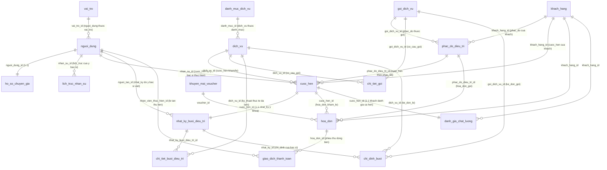

# Sơ Đồ ERD Mới Nhất (PhysioFlow Database Schema)

Tài liệu này chứa sơ đồ quan hệ cơ sở dữ liệu (ERD) mới nhất của PhysioFlow gồm **18 bảng nghiệp vụ chính** (đã loại bỏ `ho_so_dieu_tri` và đồng bộ hóa các trường loại bỏ dư thừa).

Sơ đồ được mô tả qua **Mermaid Diagram** (Hiển thị hình ảnh trực quan trên GitHub hoặc các trình đọc Markdown) và mã nguồn **DBML** để dán vào dbdiagram.io.

---

## 📊 1. SƠ ĐỒ QUAN HỆ TRỰC QUAN (MERMAID ERD)



---

## 📝 2. MÃ NGUỒN DBML (DBDIAGRAM.IO)

Bạn có thể sao chép đoạn mã bên dưới và dán vào trang web [dbdiagram.io](https://dbdiagram.io) để hiển thị và xuất sơ đồ cơ sở dữ liệu dạng đồ họa chất lượng cao:

```dbml
Table vai_tro {
  id integer [pk]
  ma_vai_tro varchar
  ten_vai_tro varchar
}

Table nguoi_dung {
  id integer [pk]
  ho_ten varchar
  email varchar
  so_dien_thoai varchar
  mat_khau_hash varchar
  vai_tro_id integer
  trang_thai varchar
}

Table ho_so_chuyen_gia {
  id integer [pk]
  nguoi_dung_id integer
  so_nam_kinh_nghiem integer
  bang_cap_chung_chi text
}

Table lich_truc_nhan_su {
  id uuid [pk]
  nhan_su_id integer
  ngay_truc date
  ca_truc varchar
  gio_bat_dau time
  gio_ket_thuc time
  trang_thai varchar
}

Table khach_hang {
  id uuid [pk]
  ho_ten varchar
  email varchar
  mat_khau_hash varchar
  so_dien_thoai varchar
  dia_chi text
  ngay_sinh date
  gioi_tinh varchar
  trang_thai varchar
}

Table nhat_ky_buoi_dieu_tri {
  id uuid [pk]
  cuoc_hen_id uuid
  nguoi_tao_id integer
  vas_truoc integer
  vas_sau integer
  chan_doan text
  chong_chi_dinh text
  ghi_chu text
  ngay_tao timestamptz
}

Table chi_tiet_buoi_dieu_tri {
  id uuid [pk]
  nhat_ky_buoi_dieu_tri_id uuid
  dich_vu_id uuid
}

Table chi_dinh_buoi {
  id uuid [pk]
  nhat_ky_id uuid
  goi_dich_vu_id uuid
  dich_vu_id uuid
  ghi_chu text
}

Table cuoc_hen {
  id uuid [pk]
  khach_hang_id uuid
  nhan_su_id integer
  dich_vu_id uuid
  phac_do_dieu_tri_id uuid
  so_thu_tu_buoi integer
  ngay_gio_bat_dau timestamptz
  ngay_gio_ket_thuc timestamptz
  loai varchar
  trang_thai varchar
  ghi_chu text
}

Table danh_muc_dich_vu {
  id integer [pk]
  ten varchar
}

Table dich_vu {
  id uuid [pk]
  ten_dich_vu varchar
  don_gia bigint
  thoi_luong_phut integer
  danh_muc_id integer
  loai_dich_vu varchar // 'KHAM' hoặc 'DIEU_TRI'
  yeu_cau_chi_dinh_kham boolean
  dang_hoat_dong boolean
}

Table goi_dich_vu {
  id uuid [pk]
  ten_goi varchar
  mo_ta text
  tong_so_buoi integer
  thoi_luong_phut integer
  don_gia bigint
  don_gia_theo_buoi bigint
  dang_hoat_dong boolean
}

Table chi_tiet_goi {
  id integer [pk]
  goi_dich_vu_id uuid
  dich_vu_id uuid
}

Table phac_do_dieu_tri {
  id uuid [pk]
  khach_hang_id uuid
  goi_dich_vu_id uuid
  tong_so_buoi integer
  so_buoi_da_dung integer
  trang_thai varchar
  ngay_kich_hoat date
  han_su_dung date
}

Table hoa_don {
  id uuid [pk]
  khach_hang_id uuid
  phac_do_dieu_tri_id uuid
  cuoc_hen_id uuid
  tong_tien_goc bigint
  hinh_thuc_thanh_toan_goi varchar
  ti_le_giam_gia_goi integer
  voucher_id uuid
  so_tien_giam_voucher bigint
  tong_tien_phai_tra bigint
  trang_thai varchar
}

Table giao_dich_thanh_toan {
  id uuid [pk]
  hoa_don_id uuid
  so_tien bigint
  loai_giao_dich varchar
  phuong_thuc varchar
  ma_tham_chieu varchar
  nhan_vien_thuc_hien_id integer
  ngay_giao_dich timestamptz
}

Table khuyen_mai_voucher {
  id uuid [pk]
  ma_code varchar
  loai_giam_gia varchar
  gia_tri_giam bigint
  giam_toi_da bigint
  don_hang_toi_thieu bigint
  ngay_bat_dau timestamptz
  ngay_het_han timestamptz
  so_luong_gioi_han integer
  so_luong_da_dung integer
  dang_kich_hoat boolean
}

Table danh_gia_chat_luong {
  id uuid [pk]
  cuoc_hen_id uuid
  khach_hang_id uuid
  so_sao integer
  nhan_xet text
}

// KHÓA NGOẠI & QUAN HỆ GIỮA CÁC BẢNG

Ref: nguoi_dung.vai_tro_id > vai_tro.id
Ref: ho_so_chuyen_gia.nguoi_dung_id - nguoi_dung.id
Ref: lich_truc_nhan_su.nhan_su_id > nguoi_dung.id

Ref: nhat_ky_buoi_dieu_tri.cuoc_hen_id - cuoc_hen.id
Ref: nhat_ky_buoi_dieu_tri.nguoi_tao_id > nguoi_dung.id

Ref: chi_tiet_buoi_dieu_tri.nhat_ky_buoi_dieu_tri_id > nhat_ky_buoi_dieu_tri.id
Ref: chi_tiet_buoi_dieu_tri.dich_vu_id > dich_vu.id

Ref: chi_dinh_buoi.nhat_ky_id > nhat_ky_buoi_dieu_tri.id
Ref: chi_dinh_buoi.goi_dich_vu_id > goi_dich_vu.id
Ref: chi_dinh_buoi.dich_vu_id > dich_vu.id

Ref: cuoc_hen.khach_hang_id > khach_hang.id
Ref: cuoc_hen.nhan_su_id > nguoi_dung.id
Ref: cuoc_hen.dich_vu_id > dich_vu.id
Ref: cuoc_hen.phac_do_dieu_tri_id > phac_do_dieu_tri.id

Ref: dich_vu.danh_muc_id > danh_muc_dich_vu.id

Ref: chi_tiet_goi.goi_dich_vu_id > goi_dich_vu.id
Ref: chi_tiet_goi.dich_vu_id > dich_vu.id

Ref: phac_do_dieu_tri.khach_hang_id > khach_hang.id
Ref: phac_do_dieu_tri.goi_dich_vu_id > goi_dich_vu.id

Ref: hoa_don.khach_hang_id > khach_hang.id
Ref: hoa_don.phac_do_dieu_tri_id > phac_do_dieu_tri.id
Ref: hoa_don.cuoc_hen_id > cuoc_hen.id
Ref: hoa_don.voucher_id > khuyen_mai_voucher.id

Ref: giao_dich_thanh_toan.hoa_don_id > hoa_don.id
Ref: giao_dich_thanh_toan.nhan_vien_thuc_hien_id > nguoi_dung.id

Ref: danh_gia_chat_luong.cuoc_hen_id - cuoc_hen.id
Ref: danh_gia_chat_luong.khach_hang_id > khach_hang.id
```
