# Hướng dẫn Vẽ Sơ đồ Thực thể - Mối quan hệ (ERD) - PhysioFlow (Bản Đầy Đủ Tất Cả Thuộc Tính)

Tài liệu này được trích xuất hoàn toàn và đầy đủ từ cấu trúc Database thực tế của hệ thống PhysioFlow. Dưới đây là định nghĩa của **toàn bộ 23 bảng**, chi tiết **từng thuộc tính** (không lược bỏ) và hướng dẫn thiết lập mối quan hệ.

---

## 🛠️ Công cụ khuyến nghị để tự vẽ
1.  **[dbdiagram.io](https://dbdiagram.io):** Gõ mã khai báo nhanh, hệ thống tự động render trực quan.
2.  **[Draw.io](https://draw.io):** Kéo thả thủ công, có sẵn ký hiệu Crow's Foot (chân chim).
3.  **[Mermaid Live Editor](https://mermaid.live):** Dán mã ở Mục 3 vào để hiển thị nhanh.

## 🛠️ Công cụ khuyến nghị để tự vẽ
1.  **[dbdiagram.io](https://dbdiagram.io):** Gõ mã khai báo nhanh, hệ thống tự động render trực quan.
2.  **[Draw.io](https://draw.io):** Kéo thả thủ công, có sẵn ký hiệu Crow's Foot (chân chim).
3.  **[Mermaid Live Editor](https://mermaid.live):** Dán mã ở Mục 3 vào để hiển thị nhanh.

---

## 🗺️ Phương pháp bố trí Layout vẽ ERD (Không bị rối mắt)

Khi vẽ một sơ đồ có tới 23 bảng, nếu đặt ngẫu nhiên các bảng và nối dây, sơ đồ sẽ biến thành một "mạng nhện" cực kỳ rối mắt. Để vẽ đẹp, khoa học và dễ bảo vệ trước hội đồng, hãy áp dụng quy tắc **Bố cục 5 Phân Vùng Hình Học** dưới đây:

### 1. Sơ đồ phân vùng vị trí (Bố cục lưới Grid)

Hãy chia trang vẽ thành 5 khu vực chính:

```text
┌─────────────────────────┬───────────────────────────┬──────────────────────────┐
│                         │        PHÂN VÙNG 4        │                          │
│       PHÂN VÙNG 1       │  Danh mục & CS Vật chất   │       PHÂN VÙNG 5        │
│    Quản trị & Nhân sự   │ (danh_muc, dich_vu, goi,  │   Tài chính/Thanh toán   │
│  (vai_tro, nguoi_dung,  │     phong, thiet_bi)      │    (hoa_don, thanh_toan, │
│  chuyen_gia, lich_truc) │             ▲             │         voucher)         │
│            │            │             │             │            ▲             │
│            ▼            │             ▼             │            │             │
│   ──────────────────────┼───────────────────────────┼──────────────────────      │
│                         │                           │                          │
│                         │        PHÂN VÙNG 2        │                          │
│                         │    Khách hàng & Đặt lịch  │                          │
│                         │    (khach_hang, lich_dat, │                          │
│                         │       ho_so_dieu_tri)     │                          │
│                         │             │             │                          │
│                         │             ▼             │                          │
│   ──────────────────────┼───────────────────────────┼──────────────────────      │
│                         │                           │                          │
│                         │        PHÂN VÙNG 3        │                          │
│                         │     Liệu trình/Trị liệu   │                          │
│                         │    (lich_dieu_tri, buoi_  │                          │
│                         │      tri_lieu, dv_buoi)   │                          │
│                         │                           │                          │
└─────────────────────────┴───────────────────────────┴──────────────────────────┘
```

#### Chi tiết cách sắp đặt từng phân vùng:

*   **PHÂN VÙNG 1: Góc bên Trái (Nhân sự & Phân quyền)**
    *   Đặt các bảng: `vai_tro`, `nguoi_dung`, `chuyen_gia_y_te`, `lich_lam_viec`, `refresh_tokens` (nếu có vẽ).
    *   *Hướng đi dây:* Đi từ trái sang phải, nối từ `nguoi_dung` sang `lich_dat` (Bác sĩ/KTV phụ trách), `ho_so_dieu_tri` (Bác sĩ khám), `buoi_tri_lieu` (KTV điều trị).
*   **PHÂN VÙNG 2: Trung tâm Phía trên (Luồng Đón tiếp & Tiếp nhận)**
    *   Đặt các bảng: `khach_hang` và `lich_dat`.
    *   Đây là "cửa ngõ" của dữ liệu. Khách hàng đặt lịch hẹn. Sau đó cuộc hẹn khám sẽ sinh ra bảng `ho_so_dieu_tri` (nằm ngay dưới `lich_dat`).
*   **PHÂN VÙNG 3: Trung tâm Phía dưới (Luồng Điều trị & Thực hiện)**
    *   Đặt các bảng: `lich_dieu_tri`, `buoi_tri_lieu`, `buoi_tri_lieu_dich_vu`, `danh_gia_dich_vu`.
    *   Bảng `ho_so_dieu_tri` (ở phân vùng 2) sẽ có mũi tên chỉ xuống `lich_dieu_tri` (ở phân vùng 3) để bắt đầu đợt trị liệu thực tế.
*   **PHÂN VÙNG 4: Góc trên bên Phải (Danh mục Dịch vụ & Phòng ban)**
    *   Đặt các bảng định nghĩa danh mục: `danh_muc_dich_vu`, `dich_vu`, `goi_dich_vu`, `goi_dich_vu_chi_tiet`, `phong`, `thiet_bi_y_te`.
    *   Các bảng này chủ yếu cung cấp thông tin "tra cứu" cho lịch đặt, buổi trị liệu và hóa đơn.
    *   *Hướng đi dây:* Các đường nối sẽ đi từ góc trên bên phải hướng chéo xuống các bảng ở trung tâm (`lich_dat`, `buoi_tri_lieu`).
*   **PHÂN VÙNG 5: Góc dưới bên Phải (Thu phí & Thanh toán)**
    *   Đặt các bảng: `hoa_don`, `thanh_toan`, `voucher`.
    *   *Hướng đi dây:* Nối từ `khach_hang` (ở trung tâm) sang `hoa_don`, và từ `lich_dieu_tri` (ở trung tâm dưới) sang `hoa_don` (Thanh toán cho cả liệu trình).

---

### 2. Quy tắc đi dây thông minh để tránh giao nhau (Line Routing Rules)
1.  **Quy tắc một chiều:** Các mối quan hệ 1-Nhiều nên đi theo hướng **từ trái sang phải** hoặc **từ trên xuống dưới**. Ví dụ: Đầu `1` nằm bên trái, đầu `Nhiều` nằm bên phải.
2.  **Đặt các bảng liên quan gần nhau tối đa:** Ví dụ:
    *   `hoa_don` phải đặt sát cạnh `thanh_toan` và `voucher` để dây nối cực ngắn, không bao giờ cắt chéo qua các bảng khác.
    *   `buoi_tri_lieu` phải đặt sát cạnh `buoi_tri_lieu_dich_vu` và `danh_gia_dich_vu`.
3.  **Hạn chế vẽ chéo góc:** Chỉ sử dụng các đường vuông góc (orthogonal lines) thay vì đường chéo. Các phần mềm như Draw.io hay dbdiagram.io đều hỗ trợ tự động căn thẳng hàng đường vuông góc.
4.  **Bỏ bớt các mối quan hệ phụ (Nêu rõ bằng lời thay vì vẽ dây):** Với một số bảng làm nhiệm vụ ghi nhận thông tin hệ thống như `thong_bao`, `refresh_tokens`, `otp_codes` - chúng liên kết với `nguoi_dung` hoặc `khach_hang` nhưng không đóng vai trò trong nghiệp vụ chính. Bạn có thể đặt chúng ở góc rìa và vẽ dây ngắn, hoặc chỉ cần liệt kê thuộc tính khóa ngoại mà không cần kéo dây dài cắt ngang qua toàn bộ sơ đồ.

---

### 3. Chia nhỏ sơ đồ để thuyết trình (Sub-ERD / Modular Presentation)
Nếu vẽ cả 23 bảng lên 1 slide thuyết trình sẽ cực kỳ bé và giảng viên không thể đọc được. Bạn nên chuẩn bị **4 sơ đồ con** (Sub-ERD) tập trung vào từng nghiệp vụ cốt lõi:

*   **Sơ đồ 1 (Phân hệ Nhân sự & Phân quyền):** Chỉ vẽ `vai_tro`, `nguoi_dung`, `chuyen_gia_y_te`, `lich_lam_viec`.
*   **Sơ đồ 2 (Phân hệ Tiếp nhận & Khám bệnh):** Vẽ `khach_hang` ── `lich_dat` ── `ho_so_dieu_tri` ── `dich_vu`/`goi_dich_vu`.
*   **Sơ đồ 3 (Phân hệ Liệu trình điều trị):** Vẽ `lich_dieu_tri` ── `buoi_tri_lieu` ── `buoi_tri_lieu_dich_vu` ── `danh_gia_dich_vu` (và liên kết tới KTV).
*   **Sơ đồ 4 (Phân hệ Tài chính & Doanh thu):** Vẽ `khach_hang` ── `hoa_don` ── `thanh_toan` (và liên kết tới `voucher`, `lich_dieu_tri`).

---

### 1.1. Bảng `vai_tro` (Vai trò)
*Vai trò:* Quản lý các vai trò phân quyền của nhân viên trong hệ thống.
*   **`id` (SmallInt, PK, Autoincrement):** Khóa chính, mã định danh duy nhất của vai trò.
*   **`ma_vai_tro` (VarChar(20), Not Null):** Mã định danh viết liền (ví dụ: `admin`, `receptionist`, `doctor`).
*   **`ten_hien_thi` (VarChar(50), Not Null):** Tên hiển thị tiếng Việt (ví dụ: `Quản lý`, `Lễ tân`).
*   **`mo_ta_quyen` (Text, Nullable):** Ghi chú mô tả các quyền hạn đi kèm vai trò này.

### 1.2. Bảng `nguoi_dung` (Người dùng - Nhân viên)
*Vai trò:* Lưu trữ tài khoản đăng nhập và thông tin cá nhân của toàn bộ nhân viên phòng khám.
*   **`id` (UUID, PK):** Khóa chính, định danh duy nhất của nhân viên (tự động tạo `gen_random_uuid()`).
*   **`ho_ten` (VarChar(150), Not Null):** Họ và tên của nhân viên.
*   **`email` (VarChar(255), Not Null):** Địa chỉ Email (dùng làm tài khoản đăng nhập).
*   **`so_dien_thoai` (VarChar(20), Nullable):** Số điện thoại liên hệ.
*   **`mat_khau_hash` (VarChar(255), Not Null):** Mật khẩu đăng nhập đã mã hóa BCrypt.
*   **`vai_tro_id` (SmallInt, FK):** Khóa ngoại liên kết đến `vai_tro(id)`.
*   **`trang_thai` (VarChar(20), Default: `'hoat_dong'`):** Trạng thái làm việc (`hoat_dong`, `khoa`, etc.).
*   **`da_xac_thuc_email` (Boolean, Default: `false`):** Xác nhận tài khoản đã xác thực qua OTP Gmail.
*   **`avatar_url` (Text, Nullable):** Đường dẫn ảnh đại diện nhân viên.
*   **`thoi_gian_tao` (Timestamp, Default: `now()`):** Thời điểm tạo tài khoản nhân viên.
*   **`lan_dang_nhap_cuoi` (Timestamp, Nullable):** Thời điểm đăng nhập gần nhất.
*   **`deleted_at` (Timestamp, Nullable):** Thời điểm xóa tài khoản (hỗ trợ xóa mềm).

### 1.3. Bảng `chuyen_gia_y_te` (Hồ sơ chuyên môn Bác sĩ/KTV)
*Vai trò:* Lưu trữ hồ sơ năng lực chuyên môn của Bác sĩ hoặc Kỹ thuật viên (kết nối 1-1 với nhân viên).
*   **`id` (UUID, PK):** Khóa chính, định danh duy nhất hồ sơ chuyên gia.
*   **`nguoi_dung_id` (UUID, FK, Not Null):** Khóa ngoại liên kết đến `nguoi_dung(id)`.
*   **`ma_nhan_vien` (VarChar(20), Not Null):** Mã số nhân viên điều trị (ví dụ: `NV-2001`).
*   **`chuyen_mon_chinh` (VarChar(200), Not Null):** Chuyên khoa điều trị chính (ví dụ: `Cột sống`, `Cơ xương khớp`).
*   **`so_nam_kinh_nghiem` (Int, Nullable):** Số năm kinh nghiệm làm việc thực tế.
*   **`chung_chi` (Text, Nullable):** Các chứng chỉ hành nghề y tế.
*   **`mo_ta_ban_than` (Text, Nullable):** Đoạn giới thiệu bản thân hiển thị trên web.
*   **`anh_dai_dien_url` (Text, Nullable):** Đường dẫn ảnh chân dung bác sĩ.
*   **`trang_thai` (VarChar(20), Default: `'hoat_dong'`):** Trạng thái làm việc (`hoat_dong`, `nghi_phep`, etc.).
*   **`ngay_vao_lam` (Date, Nullable):** Ngày bắt đầu làm việc tại phòng khám.
*   **`luong_cung_ca` (BigInt, Default: `150000`):** Lương cứng cơ bản nhận được trên mỗi ca khám.
*   **`luong_kpi_ca` (BigInt, Default: `50000`):** Tiền thưởng KPI nhận được trên mỗi ca khám thành công.

### 1.4. Bảng `khach_hang` (Khách hàng / Bệnh nhân)
*Vai trò:* Lưu trữ thông tin cá nhân và tài khoản cổng thông tin (Patient Portal) của Khách hàng/Bệnh nhân.
*   **`id` (UUID, PK):** Khóa chính, định danh duy nhất của khách hàng.
*   **`ho_ten` (VarChar(150), Not Null):** Họ và tên đầy đủ của khách hàng.
*   **`email` (VarChar(255), Unique, Nullable):** Email liên hệ đăng nhập cổng bệnh nhân.
*   **`so_dien_thoai` (VarChar(20), Nullable):** Số điện thoại liên lạc của khách.
*   **`mat_khau_hash` (VarChar(255), Nullable):** Mật khẩu đăng nhập của khách hàng đã mã hóa.
*   **`trang_thai` (VarChar(20), Default: `'hoat_dong'`):** Trạng thái khách hàng (`hoat_dong`, etc.).
*   **`da_xac_thuc_email` (Boolean, Default: `false`):** Trạng thái xác thực email của khách.
*   **`avatar_url` (Text, Nullable):** Link ảnh đại diện của khách.
*   **`lan_dang_nhap_cuoi` (Timestamp, Nullable):** Lần đăng nhập cuối cùng của khách hàng.
*   **`ngay_sinh` (Date, Nullable):** Ngày tháng năm sinh của bệnh nhân.
*   **`gioi_tinh` (VarChar(10), Nullable):** Giới tính bệnh nhân (`nam`, `nu`, `khac`).
*   **`dia_chi` (Text, Nullable):** Địa chỉ thường trú.
*   **`thoi_gian_tao` (Timestamp, Default: `now()`):** Thời gian tạo hồ sơ khách hàng.
*   **`deleted_at` (Timestamp, Nullable):** Hỗ trợ xóa mềm hồ sơ khách hàng.

### 1.5. Bảng `lich_dat` (Lịch hẹn khám / Đặt lịch)
*Vai trò:* Ghi nhận lịch hẹn khám ban đầu do khách tự đặt qua web hoặc do lễ tân đặt tại quầy.
*   **`id` (UUID, PK):** Khóa chính, định danh cuộc hẹn.
*   **`ma_lich_dat` (VarChar(20), Not Null):** Mã số cuộc hẹn hiển thị (ví dụ: `LD-94523`).
*   **`khach_hang_id` (UUID, FK, Nullable):** Khóa ngoại liên kết tới `khach_hang(id)` (bỏ trống nếu là khách vãng lai chưa lập tài khoản).
*   **`ho_ten_khach` (VarChar(150), Nullable):** Tên khách ghi nhận lúc đặt lịch hẹn.
*   **`so_dien_thoai` (VarChar(20), Nullable):** Số điện thoại của khách đặt lịch.
*   **`gioi_tinh_khach` (VarChar(10), Nullable):** Giới tính khách đặt lịch.
*   **`dich_vu_id` (UUID, FK, Nullable):** Khóa ngoại liên kết dịch vụ lẻ được đặt hẹn khám: `dich_vu(id)`.
*   **`bac_si_id` (UUID, FK, Nullable):** Khóa ngoại gán bác sĩ thực hiện khám: `chuyen_gia_y_te(id)`.
*   **`phong_id` (BigInt, FK, Nullable):** Khóa ngoại gán phòng thực hiện khám: `phong(id)`.
*   **`ngay_gio_bat_dau` (Timestamptz, Not Null):** Thời gian bắt đầu cuộc hẹn khám.
*   **`ngay_gio_ket_thuc` (Timestamptz, Not Null):** Thời gian kết thúc cuộc hẹn khám.
*   **`ly_do_kham` (Text, Nullable):** Lý do khám tổng quát.
*   **`anh_dinh_kem_url` (Text, Nullable):** Link ảnh chụp phim X-Quang/triệu chứng đính kèm.
*   **`trang_thai` (VarChar(30), Default: `'cho_xac_nhan'`):** Trạng thái (`chua_xac_nhan`, `cho_xac_nhan`, `da_xac_nhan`, `da_checkin`, `dang_kham`, `hoan_thanh`, `da_huy`, `khong_den`).
*   **`ghi_chu_dat_lich` (Text, Nullable):** Ghi chú của khách hàng lúc đặt.
*   **`ghi_chu_noi_bo` (Text, Nullable):** Ghi chú nội bộ dành riêng cho lễ tân/bác sĩ.
*   **`thoi_gian_checkin` (Timestamptz, Nullable):** Thời điểm khách hàng có mặt và làm thủ tục check-in.
*   **`thoi_gian_huy` (Timestamptz, Nullable):** Thời điểm hủy lịch hẹn.
*   **`ly_do_huy` (Text, Nullable):** Lý do hủy lịch hẹn.
*   **`nguoi_tao` (VarChar(20), Default: `'khach_hang'`):** Nguồn tạo lịch (`khach_hang`, `receptionist`, `guest`).
*   **`thoi_gian_tao` (Timestamptz, Default: `now()`):** Thời điểm đặt lịch trên hệ thống.
*   **`han_xac_nhan` (Timestamptz, Nullable):** Hạn chót xác nhận lịch (qua email hoặc gọi điện thoại).

### 1.6. Bảng `ho_so_dieu_tri` (Bệnh án Điện tử - EMR)
*Vai trò:* Lưu trữ thông tin khám lâm sàng và chẩn đoán ban đầu của bác sĩ dành cho cuộc hẹn (Lập ra phác đồ).
*   **`id` (UUID, PK):** Khóa chính hồ sơ bệnh án.
*   **`lich_dat_id` (UUID, FK, Unique, Not Null):** Khóa ngoại liên kết 1-1 với lịch hẹn `lich_dat(id)`.
*   **`chuyen_gia_id` (UUID, FK, Nullable):** Khóa ngoại liên kết bác sĩ khám bệnh: `chuyen_gia_y_te(id)`.
*   **`chan_doan` (Text, Nullable):** Kết luận chẩn đoán y khoa.
*   **`chong_chi_dinh` (Text, Nullable):** Các điểm cấm thực hiện (như không điện xung đối với người có máy tạo nhịp tim).
*   **`goi_dich_vu_id` (UUID, FK, Nullable):** Khóa ngoại gợi ý gói dịch vụ điều trị: `goi_dich_vu(id)`.
*   **`dich_vu_id` (UUID, FK, Nullable):** Khóa ngoại gợi ý dịch vụ lẻ điều trị: `dich_vu(id)`.
*   **`ghi_chu` (Text, Nullable):** Nhận xét thêm của bác sĩ.
*   **`thoi_gian_tao` (Timestamptz, Default: `now()`):** Thời điểm lập bệnh án.

### 1.7. Bảng `lich_dieu_tri` (Liệu trình / Phác đồ điều trị)
*Vai trò:* Kế hoạch điều trị tổng thể của một bệnh nhân, bao gồm số lượng buổi khám cần thực hiện.
*   **`id` (UUID, PK):** Khóa chính của phác đồ điều trị.
*   **`khach_hang_id` (UUID, FK, Not Null):** Khóa ngoại liên kết bệnh nhân sở hữu phác đồ: `khach_hang(id)`.
*   **`loai_dieu_tri` (VarChar(20), Not Null):** Phân loại liệu trình (`theo_goi` hoặc `dich_vu_le`).
*   **`tong_so_buoi` (Int, Not Null):** Tổng số buổi điều trị cần thực hiện.
*   **`so_buoi_da_dung` (Int, Default: `0`):** Số buổi bệnh nhân đã thực tế thực hiện điều trị.
*   **`trang_thai` (VarChar(20), Default: `'dang_dieu_tri'`):** Trạng thái phác đồ (`dang_dieu_tri`, `hoan_thanh`, `tam_dung`).
*   **`thoi_gian_tao` (Timestamptz, Default: `now()`):** Ngày thiết lập phác đồ điều trị.
*   **`ma_lich_dieu_tri` (VarChar(20), Unique, Nullable):** Mã số hồ sơ phác đồ hiển thị.
*   **`phong_id` (BigInt, FK, Nullable):** Khóa ngoại liên kết phòng điều trị mặc định: `phong(id)`.
*   **`ghi_chu_noi_bo` (Text, Nullable):** Ghi chú nội bộ về liệu trình của người bệnh.
*   **`ngay_bat_dau` (Timestamp, Nullable):** Ngày bắt đầu thực tế buổi điều trị đầu tiên.
*   **`ngay_ket_thuc` (Timestamp, Nullable):** Ngày hoàn thành phác đồ.
*   **`ho_so_dieu_tri_id` (UUID, FK, Nullable):** Khóa ngoại liên kết bệnh án gốc sinh ra phác đồ: `ho_so_dieu_tri(id)`.

### 1.8. Bảng `buoi_tri_lieu` (Buổi điều trị cụ thể)
*Vai trò:* Từng buổi thực hiện trị liệu chi tiết của bệnh nhân trong phác đồ điều trị.
*   **`id` (UUID, PK):** Khóa chính của buổi điều trị.
*   **`lich_dieu_tri_id` (UUID, FK, Not Null):** Khóa ngoại liên kết phác đồ chủ quản: `lich_dieu_tri(id)`.
*   **`khach_hang_id` (UUID, FK, Not Null):** Khóa ngoại liên kết khách hàng thụ hưởng: `khach_hang(id)`.
*   **`ky_thuat_vien_id` (UUID, FK, Not Null):** Khóa ngoại chỉ định KTV thực hiện buổi trị liệu: `chuyen_gia_y_te(id)`.
*   **`phong_id` (BigInt, FK, Nullable):** Khóa ngoại chỉ định phòng điều trị: `phong(id)`.
*   **`dich_vu_id` (UUID, FK, Nullable):** Khóa ngoại liên kết dịch vụ chính của buổi: `dich_vu(id)`.
*   **`thoi_gian_bat_dau` (Timestamptz, Not Null):** Giờ bắt đầu thực hiện buổi điều trị.
*   **`thoi_gian_ket_thuc` (Timestamptz, Nullable):** Giờ hoàn tất thực hiện buổi điều trị.
*   **`danh_gia_truoc_buoi` (Int, Nullable):** Thang điểm mức độ đau nhức của bệnh nhân trước trị liệu (1-10).
*   **`danh_gia_sau_buoi` (Int, Nullable):** Thang điểm mức độ đau nhức của bệnh nhân sau trị liệu (1-10).
*   **`danh_gia_hieu_qua` (Int, Nullable):** Nhận xét mức độ tiến triển của buổi trị liệu.
*   **`so_thu_tu_buoi` (Int, Nullable):** Số thứ tự buổi đang điều trị (Ví dụ: Buổi thứ 3 / 10).
*   **`trang_thai` (VarChar(20), Default: `'dang_thuc_hien'`):** Trạng thái buổi (`cho_xac_nhan`, `dang_thuc_hien`, `hoan_thanh`, `huy`).
*   **`canh_bao_dac_biet` (Text, Nullable):** Cảnh báo an toàn trong buổi trị liệu.
*   **`ai_tom_tat_ngan` (VarChar(300), Nullable):** Đoạn tóm tắt nhanh nội dung buổi trị liệu sinh ra tự động bởi AI.
*   **`thoi_gian_ghi_chu` (Timestamptz, Nullable):** Thời điểm ghi nhận báo cáo buổi.

### 1.9. Bảng `buoi_tri_lieu_dich_vu` (Chi tiết Dịch vụ trong buổi trị liệu)
*Vai trò:* Bảng liên kết trung gian (Junction Table) mô tả chi tiết danh sách dịch vụ kỹ thuật áp dụng trong một buổi điều trị cụ thể.
*   **`id` (UUID, PK):** Khóa chính dòng chi tiết dịch vụ buổi.
*   **`buoi_tri_lieu_id` (UUID, FK, Not Null):** Khóa ngoại liên kết buổi trị liệu: `buoi_tri_lieu(id)`.
*   **`dich_vu_id` (UUID, FK, Not Null):** Khóa ngoại liên kết dịch vụ kỹ thuật: `dich_vu(id)`.
*   **`so_luong` (Int, Default: `1`):** Số lần thực hiện dịch vụ trong buổi.
*   **`thoi_gian_thuc_hien` (Timestamp, Default: `now()`):** Thời gian thực hiện dịch vụ kỹ thuật.
*   **`ktv_id` (UUID, FK, Nullable):** Khóa ngoại chỉ định KTV phụ trách dịch vụ này.
*   **`loai_dich_vu_su_dung` (VarChar(20), Default: `'trong_goi'`):** Phân loại dịch vụ dùng (`trong_goi` hoặc `phat_sinh`).
*   **`trang_thai` (VarChar(20), Default: `'da_duyet'`):** Trạng thái được duyệt điều trị.
*   **`ghi_chu_ly_do` (Text, Nullable):** Lý do thêm dịch vụ phát sinh hoặc ghi chú chi tiết.
*   **`duyet_boi` (UUID, FK, Nullable):** Khóa ngoại liên kết nhân viên duyệt phát sinh: `nguoi_dung(id)`.
*   **`duyet_luc` (Timestamp, Nullable):** Thời điểm phê duyệt.

### 1.10. Bảng `dich_vu` (Dịch vụ y khoa lẻ)
*Vai trò:* Danh mục các dịch vụ kỹ thuật trị liệu đơn lẻ của phòng khám.
*   **`id` (UUID, PK):** Khóa chính dịch vụ.
*   **`danh_muc_id` (BigInt, FK, Not Null):** Khóa ngoại phân loại dịch vụ: `danh_muc_dich_vu(id)`.
*   **`ten_dich_vu` (VarChar(200), Not Null):** Tên dịch vụ trị liệu (ví dụ: `Trị liệu giải phóng cơ sâu`).
*   **`mo_ta_ngan` (VarChar(500), Nullable):** Mô tả ngắn gọn về dịch vụ.
*   **`mo_ta_chi_tiet` (Text, Nullable):** Tài liệu mô tả chi tiết phương pháp kỹ thuật.
*   **`thoi_luong_phut` (Int, Not Null):** Thời gian thực hiện trung bình của ca (phút).
*   **`don_gia` (BigInt, Not Null):** Đơn giá dịch vụ lẻ (VNĐ).
*   **`hinh_anh_url` (Text, Nullable):** Đường dẫn ảnh giới thiệu dịch vụ.
*   **`trang_thai` (VarChar(20), Default: `'hoat_dong'`):** Trạng thái hoạt động (`hoat_dong` hoặc `tam_ngung`).
*   **`thu_tu_hien_thi` (Int, Default: `0`):** Thứ tự sắp xếp hiển thị trên website.
*   **`thiet_bi_yeu_cau` (VarChar(255), Nullable):** Thiết bị y tế bắt buộc để làm dịch vụ này (dùng kiểm tra nghẽn).
*   **`loai_dich_vu` (VarChar(20), Default: `'chinh'`):** Phân loại dịch vụ (`chinh` hoặc `ho_tro`).
*   **`hien_thi_website` (Boolean, Default: `true`):** Cấu hình hiển thị dịch vụ ra trang ngoài cho khách hàng xem.
*   **`loai_dich_vu_ho_tro` (Json, Default: `'[]'`):** Danh sách các dịch vụ hỗ trợ đi kèm được phép đề xuất.

### 1.11. Bảng `goi_dich_vu` (Gói trị liệu)
*Vai trò:* Gói điều trị dài hạn bao gồm nhiều buổi hoặc dịch vụ kết hợp với mức giá ưu đãi.
*   **`id` (UUID, PK):** Khóa chính gói dịch vụ.
*   **`ten_goi` (VarChar(200), Not Null):** Tên gói trị liệu (ví dụ: `Liệu trình Điều trị Thoát vị đĩa đệm`).
*   **`ma_goi` (VarChar(30), Unique, Not Null):** Mã ký hiệu của gói (ví dụ: `GOI-TVDD`).
*   **`mo_ta` (Text, Nullable):** Mô tả chi tiết liệu trình trong gói.
*   **`tong_so_buoi` (Int, Not Null):** Tổng số buổi điều trị có trong gói.
*   **`gia_goi` (BigInt, Not Null):** Giá tiền bán thực tế của gói (VNĐ).
*   **`gia_goc` (BigInt, Nullable):** Giá gốc tổng tiền dịch vụ lẻ để so sánh ưu đãi.
*   **`han_dung_thang` (Int, Default: `6`):** Thời hạn sử dụng gói kể từ ngày mua (tháng).
*   **`hien_thi_website` (Boolean, Default: `true`):** Cấu hình hiển thị gói ra ngoài website.
*   **`trang_thai` (VarChar(20), Default: `'hoat_dong'`):** Trạng thái gói (`hoat_dong` hoặc `ngung_ban`).
*   **`thoi_gian_tao` (Timestamptz, Default: `now()`):** Thời điểm tạo gói liệu trình.
*   **`danh_muc_id` (BigInt, FK, Nullable):** Khóa ngoại liên kết danh mục dịch vụ: `danh_muc_dich_vu(id)`.
*   **`loai_goi` (VarChar(20), Default: `'lieu_trinh'`):** Phân loại gói (`lieu_trinh` hoặc `cham_soc`).
*   **`so_dv_toi_da_moi_buoi` (Int, Default: `5`):** Số lượng dịch vụ tối đa được thực hiện trong 1 buổi của gói.
*   **`phan_tram_giam_tra_thang` (Int, Default: `10`):** Tỷ lệ giảm giá khi thanh toán thẳng 100%.
*   **`phan_tram_giam_tra_gop` (Int, Default: `5`):** Tỷ lệ giảm giá khi lựa chọn trả góp.

### 1.12. Bảng `goi_dich_vu_chi_tiet` (Thành phần Dịch vụ trong gói)
*Vai trò:* Danh sách các dịch vụ lẻ và số buổi của từng dịch vụ được cấu hình sẵn bên trong một gói dịch vụ.
*   **`id` (Int, PK, Autoincrement):** Khóa chính dòng chi tiết cấu hình gói.
*   **`goi_dich_vu_id` (UUID, FK, Nullable):** Khóa ngoại liên kết gói dịch vụ: `goi_dich_vu(id)`.
*   **`dich_vu_id` (UUID, FK, Nullable):** Khóa ngoại liên kết dịch vụ lẻ thành phần: `dich_vu(id)`.
*   **`so_buoi_trong_goi` (Int, Default: `1`):** Số buổi định mức tối thiểu phải thực hiện của dịch vụ này.
*   **`so_lan_toi_da_trong_goi` (Int, Default: `10`):** Giới hạn số lần thực hiện tối đa dịch vụ này trong gói.
*   **`bat_buoc` (Boolean, Default: `false`):** Đánh dấu dịch vụ bắt buộc phải thực hiện trong liệu trình.
*   **`thu_tu_thuc_hien` (Int, Default: `0`):** Thứ tự ưu tiên thực hiện dịch vụ này.

### 1.13. Bảng `danh_gia_dich_vu` (Đánh giá của bệnh nhân)
*Vai trò:* Lưu trữ ý kiến đánh giá và số sao bình chọn của khách hàng sau khi hoàn thành buổi trị liệu.
*   **`id` (UUID, PK):** Khóa chính đánh giá.
*   **`buoi_tri_lieu_id` (UUID, FK, Not Null):** Khóa ngoại liên kết buổi trị liệu được đánh giá: `buoi_tri_lieu(id)`.
*   **`khach_hang_id` (UUID, FK, Not Null):** Khóa ngoại liên kết khách hàng đánh giá: `khach_hang(id)`.
*   **`ky_thuat_vien_id` (UUID, FK, Not Null):** Khóa ngoại liên kết KTV thực hiện buổi đó: `chuyen_gia_y_te(id)`.
*   **`so_sao_tong` (Int, Not Null):** Đánh giá số sao tổng quan buổi điều trị (1-5 sao).
*   **`so_sao_ktv` (Int, Nullable):** Đánh giá thái độ phục vụ riêng của Kỹ thuật viên (1-5 sao).
*   **`nhan_xet` (Text, Nullable):** Đoạn nhận xét chi tiết bằng văn bản của khách hàng.
*   **`hieu_qua_dieu_tri` (VarChar(30), Nullable):** Đánh giá khách quan mức độ thuyên giảm đau nhức.
*   **`se_quay_lai` (Boolean, Nullable):** Khách hàng có mong muốn quay lại tiếp tục trị liệu không.
*   **`hien_thi_cong_khai` (Boolean, Default: `false`):** Cho phép hiển thị phản hồi này lên trang chủ website công khai.
*   **`thoi_gian_danh_gia` (Timestamp, Default: `now()`):** Thời điểm khách hàng gửi đánh giá.

### 1.14. Bảng `danh_muc_dich_vu` (Danh mục Dịch vụ)
*Vai trò:* Phân loại nhóm các dịch vụ hoặc gói dịch vụ (ví dụ: Chuyên khoa Cột sống, Nhóm Cơ xương khớp).
*   **`id` (BigInt, PK, Autoincrement):** Khóa chính danh mục.
*   **`ten_danh_muc` (VarChar(100), Not Null):** Tên nhóm danh mục dịch vụ.
*   **`mo_ta` (Text, Nullable):** Mô tả chi tiết về nhóm danh mục.
*   **`thu_tu_hien_thi` (Int, Default: `0`):** Thứ tự hiển thị sắp xếp trên website.
*   **`an_hien` (Boolean, Default: `true`):** Cấu hình ẩn/hiện danh mục ra website.
*   **`loai_danh_muc` (VarChar(20), Default: `'dich_vu'`):** Nhóm dành cho dịch vụ lẻ (`dich_vu`) hoặc gói (`goi_dich_vu`).

### 1.15. Bảng `phong` (Phòng chức năng)
*Vai trò:* Danh sách phòng chức năng dùng để đặt lịch khám hoặc tiến hành trị liệu vật lý.
*   **`id` (BigInt, PK, Autoincrement):** Khóa chính phòng.
*   **`ten_phong` (VarChar(100), Not Null):** Tên phòng (ví dụ: `Phòng Trị liệu Cột Sống P101`).
*   **`ma_phong` (VarChar(20), Not Null):** Mã ký hiệu phòng (ví dụ: `P101`).
*   **`loai_phong` (VarChar(100), Nullable):** Phân loại phòng (`kham_lam_sang`, `vat_ly_tri_lieu`, etc.).
*   **`mo_ta` (Text, Nullable):** Mô tả trang thiết bị chung của phòng.
*   **`trang_thai` (VarChar(20), Default: `'san_sang'`):** Trạng thái sử dụng phòng (`san_sang` hoặc `bao_tri`).
*   **`tang` (VarChar(20), Nullable):** Tầng vị trí phòng trong tòa nhà (ví dụ: `Tầng 1`).
*   **`so_luong_giuong` (Int, Default: `1`):** Số lượng giường bệnh hoạt động đồng thời tối đa trong phòng.

### 1.16. Bảng `thiet_bi_y_te` (Thiết bị Y tế)
*Vai trò:* Quản lý trang thiết bị y tế phân bổ tại các phòng phục vụ điều trị (dùng để kiểm soát khả năng lấp đầy / tắc nghẽn thiết bị).
*   **`id` (UUID, PK):** Khóa chính thiết bị.
*   **`ma_thiet_bi` (VarChar(20), Unique, Not Null):** Mã số định danh thiết bị (ví dụ: `TB-LASER-01`).
*   **`ten_thiet_bi` (VarChar(100), Not Null):** Tên thiết bị y tế (ví dụ: `Máy chiếu Laser công suất lớn`).
*   **`loai_thiet_bi` (VarChar(100), Nullable):** Nhóm công nghệ thiết bị.
*   **`ngay_mua` (Date, Nullable):** Ngày đưa máy về phòng khám sử dụng.
*   **`trang_thai` (VarChar(20), Default: `'san_sang'`):** Trạng thái máy (`san_sang`, `dang_su_dung`, `dang_bao_tri`).
*   **`phong_id_hien_tai` (BigInt, FK, Nullable):** Khóa ngoại chỉ vị trí phòng đang đặt máy hiện tại: `phong(id)`.
*   **`ghi_chu` (Text, Nullable):** Ghi chú thông số máy.
*   **`thoi_gian_tao` (Timestamp, Default: `now()`):** Ngày khởi tạo máy trên hệ thống.
*   **`so_lan_su_dung` (Int, Default: `0`):** Tổng số ca trị liệu máy đã vận hành thực tế.
*   **`nguong_canh_bao` (Int, Default: `80`):** Số ca chạy giới hạn để phát thông báo nhắc nhở bảo trì máy định kỳ.
*   **`nguong_bat_buoc_bao_tri` (Int, Default: `100`):** Số ca chạy bắt buộc dừng máy để đưa vào bảo trì.
*   **`tan_suat_bao_tri_ngay` (Int, Default: `45`):** Số ngày định kỳ cần kiểm tra máy định mức.
*   **`ngay_bao_tri_gan_nhat` (Date, Nullable):** Ngày bảo dưỡng máy gần nhất.
*   **`cap_rui_ro` (VarChar(20), Default: `'trung_binh'`):** Mức độ rủi ro hoạt động máy (`thap`, `trung_binh`, `cao`).

### 1.17. Bảng `lich_lam_viec` (Lịch trực / Lịch làm việc nhân viên)
*Vai trò:* Phân ca trực và ghi nhận chấm công hàng ngày cho Bác sĩ, KTV hoặc lễ tân.
*   **`id` (UUID, PK):** Khóa chính ca trực.
*   **`nguoi_dung_id` (UUID, FK, Not Null):** Khóa ngoại gán ca cho nhân viên: `nguoi_dung(id)`.
*   **`ngay` (Date, Not Null):** Ngày trực ca.
*   **`gio_bat_dau` (Time, Not Null):** Giờ bắt đầu ca trực.
*   **`gio_ket_thuc` (Time, Not Null):** Giờ kết thúc ca trực.
*   **`trang_thai` (VarChar(20), Default: `'hoat_dong'`):** Trạng thái lịch trực (`hoat_dong`, `dang_truc`, `nghi`).
*   **`thoi_gian_checkin` (Timestamptz, Nullable):** Giờ nhân viên chấm công quét vân tay vào ca trực.
*   **`thoi_gian_checkout` (Timestamptz, Nullable):** Giờ nhân viên quét vân tay ra ca.
*   **`trang_thai_cham_cong` (VarChar(30), Nullable):** Phân loại chấm công (`dung_gio`, `di_muon`, `ve_som`, `vang_mat`).
*   **`phong_id` (BigInt, FK, Nullable):** Khóa ngoại phân bổ trực tại phòng: `phong(id)`.
*   **`giuong_so` (Int, Nullable):** Số giường trực phục vụ trong phòng.

### 1.18. Bảng `thong_bao` (Thông báo)
*Vai trò:* Lưu trữ lịch sử thông báo hệ thống gửi tới nhân viên hoặc khách hàng.
*   **`id` (UUID, PK):** Khóa chính thông báo.
*   **`nguoi_dung_id` (UUID, FK, Nullable):** Khóa ngoại gửi đến tài khoản nhân viên: `nguoi_dung(id)`.
*   **`khach_hang_id` (UUID, FK, Nullable):** Khóa ngoại gửi đến tài khoản khách hàng: `khach_hang(id)`.
*   **`tieu_de` (VarChar(200), Not Null):** Tiêu đề thông báo.
*   **`noi_dung` (Text, Not Null):** Nội dung thông điệp chi tiết.
*   **`loai` (VarChar(30), Default: `'he_thong'`):** Phân nhóm thông báo (`he_thong`, `dat_lich`, `nhac_nho_tri_lieu`).
*   **`da_doc` (Boolean, Default: `false`):** Trạng thái người nhận đã click đọc thông báo.
*   **`thoi_gian_tao` (Timestamp, Default: `now()`):** Thời điểm phát hành thông báo.

### 1.19. Bảng `otp_codes` (Mã xác thực OTP)
*Vai trò:* Lưu trữ mã xác thực OTP gửi qua email để đăng ký hoặc khôi phục mật khẩu.
*   **`id` (UUID, PK):** Khóa chính dòng ghi nhận OTP.
*   **`email` (VarChar(255), Not Null):** Email nhận mã OTP.
*   **`otp` (VarChar(6), Not Null):** Mã số xác thực gồm 6 chữ số (ví dụ: `451293`).
*   **`expires_at` (Timestamptz, Not Null):** Thời điểm mã OTP hết hiệu lực (thường sau 10 phút sinh ra).
*   **`created_at` (Timestamptz, Default: `now()`):** Thời điểm sinh mã OTP.

### 1.20. Bảng `refresh_tokens` (Tokens làm mới phiên đăng nhập)
*Vai trò:* Lưu trữ mã refresh token để duy trì trạng thái đăng nhập cho tài khoản của nhân viên và khách hàng.
*   **`id` (Int, PK, Autoincrement):** Khóa chính.
*   **`nguoi_dung_id` (UUID, FK, Nullable):** Khóa ngoại liên kết nhân viên: `nguoi_dung(id)`.
*   **`khach_hang_id` (UUID, FK, Nullable):** Khóa ngoại liên kết khách hàng: `khach_hang(id)`.
*   **`token` (Text, Not Null):** Giá trị chuỗi JWT Refresh Token.
*   **`expires_at` (Timestamp, Not Null):** Thời điểm token hết hạn sử dụng.
*   **`created_at` (Timestamp, Default: `now()`):** Thời điểm tạo token.

### 1.21. Bảng `hoa_don` (Hóa đơn tài chính)
*Vai trò:* Hóa đơn ghi nhận số tiền thanh toán của khách hàng đối với các dịch vụ lẻ hoặc liệu trình điều trị.
*   **`id` (UUID, PK):** Khóa chính hóa đơn.
*   **`ma_hoa_don` (VarChar(20), Not Null):** Số hóa đơn xuất ra (ví dụ: `HD-2026-0001`).
*   **`khach_hang_id` (UUID, FK, Not Null):** Khóa ngoại liên kết khách hàng chi trả: `khach_hang(id)`.
*   **`loai_hoa_don` (VarChar(20), Not Null):** Phân loại hóa đơn thanh toán (`goi_dich_vu` hoặc `dich_vu_le`).
*   **`tong_tien_truoc_giam` (BigInt, Default: `0`):** Tổng trị giá ban đầu của các mặt hàng.
*   **`so_tien_giam` (BigInt, Default: `0`):** Số tiền chiết khấu giảm giá trực tiếp.
*   **`tong_tien_thanh_toan` (BigInt, Not Null):** Tổng số tiền khách hàng thực tế cần thanh toán sau khi trừ giảm giá.
*   **`da_thanh_toan` (BigInt, Default: `0`):** Số tiền khách hàng đã thực hiện thanh toán cho tới hiện tại (hỗ trợ trả góp nhiều lần).
*   **`trang_thai` (VarChar(30), Default: `'chua_thanh_toan'`):** Trạng thái hóa đơn (`chua_thanh_toan`, `thanh_toan_mot_phan`, `da_thanh_toan`, `da_hoan_tien`).
*   **`ghi_chu` (Text, Nullable):** Ghi chú thông tin thu phí.
*   **`ngay_tao` (Timestamp, Default: `now()`):** Ngày lập hóa đơn.
*   **`ngay_thanh_toan` (Timestamp, Nullable):** Ngày khách thanh toán đủ tiền hóa đơn.
*   **`thu_boi` (UUID, FK, Nullable):** Khóa ngoại gán nhân viên thu phí trực tiếp: `nguoi_dung(id)`.
*   **`loai_thanh_toan` (VarChar(20), Default: `'tra_thang'`):** Hình thức trả tiền (`tra_thang` 100% hoặc `tra_gop` nhiều đợt).
*   **`voucher_id` (UUID, FK, Nullable):** Khóa ngoại áp dụng mã giảm giá: `voucher(id)`.
*   **`so_tien_giam_voucher` (BigInt, Default: `0`):** Trị giá tiền được giảm trừ từ mã khuyến mãi voucher.
*   **`so_tien_giam_phuong_thuc` (BigInt, Default: `0`):** Chiết khấu theo hình thức thanh toán (ví dụ: Giảm thêm 5% khi chuyển khoản).
*   **`lich_dieu_tri_id` (UUID, FK, Nullable):** Khóa ngoại liên kết phác đồ điều trị xuất hóa đơn: `lich_dieu_tri(id)`.

### 1.22. Bảng `thanh_toan` (Giao dịch chi tiết của hóa đơn)
*Vai trò:* Ghi nhận lịch sử từng đợt đóng tiền chi tiết (chuyển khoản/tiền mặt) cho một hóa đơn cụ thể.
*   **`id` (UUID, PK):** Khóa chính giao dịch.
*   **`ma_giao_dich` (VarChar(50), Not Null):** Mã định danh giao dịch (ví dụ: mã giao dịch ngân hàng).
*   **`hoa_don_id` (UUID, FK, Not Null):** Khóa ngoại liên kết hóa đơn tương ứng: `hoa_don(id)`.
*   **`so_tien` (BigInt, Not Null):** Số tiền đóng trong đợt này (VNĐ).
*   **`phuong_thuc` (VarChar(20), Not Null):** Kênh đóng tiền (`tien_mat`, `chuyen_khoan`, `the_tin_dung`).
*   **`trang_thai` (VarChar(20), Default: `'cho_xu_ly'`):** Trạng thái giao dịch (`cho_xu_ly`, `thanh_cong`, `that_bai`).
*   **`ma_tham_chieu` (VarChar(100), Nullable):** Mã tham chiếu ngân hàng liên kết hoặc số biên lai.
*   **`nguoi_thu_tien_id` (UUID, Nullable):** Khóa ngoại nhân viên thực hiện thu tiền giao dịch này: `nguoi_dung(id)`.
*   **`thoi_gian_giao_dich` (Timestamp, Default: `now()`):** Ngày giờ thực hiện giao dịch đóng tiền.
*   **`ghi_chu` (Text, Nullable):** Ghi chú thông tin chi tiết.

### 1.23. Bảng `voucher` (Mã giảm giá Khuyến mãi)
*Vai trò:* Quản lý các chiến dịch mã giảm giá do quản lý/admin tạo để tặng khách hàng.
*   **`id` (UUID, PK):** Khóa chính của mã giảm giá.
*   **`ma_voucher` (VarChar(50), Not Null):** Chuỗi ký tự mã giảm giá (ví dụ: `PHYSIO50K`, `CHAMSOCTOT`).
*   **`ten_chien_dich` (VarChar(200), Nullable):** Tên chương trình ưu đãi khuyến mãi.
*   **`loai_giam` (VarChar(20), Not Null):** Cách thức giảm (`so_tien` trừ thẳng hoặc `phan_tram` giảm giá).
*   **`gia_tri_giam` (BigInt, Not Null):** Trị giá tiền được giảm hoặc tỷ lệ % giảm.
*   **`giam_toi_da` (BigInt, Nullable):** Giới hạn số tiền giảm tối đa (nếu là loại giảm theo %).
*   **`don_hang_toi_thieu` (BigInt, Default: `0`):** Giá trị đơn hàng tối thiểu bắt buộc để áp dụng mã này.
*   **`so_luong_toi_da` (Int, Nullable):** Tổng lượt phát hành tối đa của mã.
*   **`so_luong_da_dung` (Int, Default: `0`):** Số lượt mã đã thực tế được khách sử dụng thành công.
*   **`ngay_bat_dau` (Date, Not Null):** Ngày bắt đầu có hiệu lực sử dụng của mã.
*   **`ngay_het_han` (Date, Nullable):** Ngày mã hết hiệu lực.
*   **`tao_boi` (UUID, FK, Not Null):** Khóa ngoại liên kết admin tạo ra chiến dịch: `nguoi_dung(id)`.
*   **`trang_thai` (VarChar(20), Default: `'hoat_dong'`):** Trạng thái hoạt động (`hoat_dong` hoặc `het_han`/`tam_dung`).
*   **`thoi_gian_tao` (Timestamp, Default: `now()`):** Ngày khởi tạo chương trình voucher.
*   **`yeu_cau_thanh_toan` (VarChar(30), Default: `'tat_ca'`):** Cấu hình hình thức thanh toán áp dụng (`tat_ca`, `tra_thang`, `tra_gop`).

---

## 2. Bản vẽ mối quan hệ chi tiết từng cặp bảng (1 - Nhiều / 1 - 1)

Dưới đây là mô tả chi tiết đường nối của **tất cả mối liên kết** trong ERD theo chuẩn Khoá ngoại (Foreign Keys):

### 2.1. Nhóm Phân quyền và Thông tin Nhân viên
1.  `vai_tro` ─── `nguoi_dung` (**1 - Nhiều**):
    *   *Đường nối:* **1** ở `vai_tro(id)` ─── **Nhiều** ở `nguoi_dung(vai_tro_id)`
2.  `nguoi_dung` ─── `chuyen_gia_y_te` (**1 - 0..1**):
    *   *Đường nối:* **1** ở `nguoi_dung(id)` ─── **1 (Unique)** ở `chuyen_gia_y_te(nguoi_dung_id)`
3.  `nguoi_dung` ─── `lich_lam_viec` (**1 - Nhiều**):
    *   *Đường nối:* **1** ở `nguoi_dung(id)` ─── **Nhiều** ở `lich_lam_viec(nguoi_dung_id)`
4.  `nguoi_dung` ─── `voucher` (**1 - Nhiều**):
    *   *Đường nối:* **1** ở `nguoi_dung(id)` ─── **Nhiều** ở `voucher(tao_boi)`

### 2.2. Nhóm Tiếp nhận & Đặt lịch
5.  `khach_hang` ─── `lich_dat` (**1 - Nhiều**):
    *   *Đường nối:* **1** ở `khach_hang(id)` ─── **Nhiều** ở `lich_dat(khach_hang_id)` (Nullable)
6.  `chuyen_gia_y_te` ─── `lich_dat` (**1 - Nhiều**):
    *   *Đường nối:* **1** ở `chuyen_gia_y_te(id)` ─── **Nhiều** ở `lich_dat(bac_si_id)` (Nullable)
7.  `phong` ─── `lich_dat` (**1 - Nhiều**):
    *   *Đường nối:* **1** ở `phong(id)` ─── **Nhiều** ở `lich_dat(phong_id)` (Nullable)
8.  `dich_vu` ─── `lich_dat` (**1 - Nhiều**):
    *   *Đường nối:* **1** ở `dich_vu(id)` ─── **Nhiều** ở `lich_dat(dich_vu_id)` (Nullable)

### 2.3. Nhóm Khám bệnh & Lên phác đồ
9.  `lich_dat` ─── `ho_so_dieu_tri` (**1 - 1**):
    *   *Đường nối:* **1** ở `lich_dat(id)` ─── **1 (Unique)** ở `ho_so_dieu_tri(lich_dat_id)`
10. `chuyen_gia_y_te` ─── `ho_so_dieu_tri` (**1 - Nhiều**):
    *   *Đường nối:* **1** ở `chuyen_gia_y_te(id)` ─── **Nhiều** ở `ho_so_dieu_tri(chuyen_gia_id)` (Nullable)
11. `goi_dich_vu` ─── `ho_so_dieu_tri` (**1 - Nhiều**):
    *   *Đường nối:* **1** ở `goi_dich_vu(id)` ─── **Nhiều** ở `ho_so_dieu_tri(goi_dich_vu_id)` (Nullable)
12. `dich_vu` ─── `ho_so_dieu_tri` (**1 - Nhiều**):
    *   *Đường nối:* **1** ở `dich_vu(id)` ─── **Nhiều** ở `ho_so_dieu_tri(dich_vu_id)` (Nullable)

### 2.4. Nhóm Trị liệu Liệu trình
13. `khach_hang` ─── `lich_dieu_tri` (**1 - Nhiều**):
    *   *Đường nối:* **1** ở `khach_hang(id)` ─── **Nhiều** ở `lich_dieu_tri(khach_hang_id)`
14. `phong` ─── `lich_dieu_tri` (**1 - Nhiều**):
    *   *Đường nối:* **1** ở `phong(id)` ─── **Nhiều** ở `lich_dieu_tri(phong_id)` (Nullable)
15. `ho_so_dieu_tri` ─── `lich_dieu_tri` (**1 - Nhiều**):
    *   *Đường nối:* **1** ở `ho_so_dieu_tri(id)` ─── **Nhiều** ở `lich_dieu_tri(ho_so_dieu_tri_id)` (Nullable)

### 2.5. Nhóm Buổi trị liệu & Dịch vụ chi tiết
16. `lich_dieu_tri` ─── `buoi_tri_lieu` (**1 - Nhiều**):
    *   *Đường nối:* **1** ở `lich_dieu_tri(id)` ─── **Nhiều** ở `buoi_tri_lieu(lich_dieu_tri_id)`
17. `khach_hang` ─── `buoi_tri_lieu` (**1 - Nhiều**):
    *   *Đường nối:* **1** ở `khach_hang(id)` ─── **Nhiều** ở `buoi_tri_lieu(khach_hang_id)`
18. `chuyen_gia_y_te` ─── `buoi_tri_lieu` (**1 - Nhiều**):
    *   *Đường nối:* **1** ở `chuyen_gia_y_te(id)` ─── **Nhiều** ở `buoi_tri_lieu(ky_thuat_vien_id)`
19. `phong` ─── `buoi_tri_lieu` (**1 - Nhiều**):
    *   *Đường nối:* **1** ở `phong(id)` ─── **Nhiều** ở `buoi_tri_lieu(phong_id)` (Nullable)
20. `dich_vu` ─── `buoi_tri_lieu` (**1 - Nhiều**):
    *   *Đường nối:* **1** ở `dich_vu(id)` ─── **Nhiều** ở `buoi_tri_lieu(dich_vu_id)` (Nullable)

### 2.6. Nhóm Dịch vụ chi tiết trong Buổi và Cấu hình Gói
21. `buoi_tri_lieu` ─── `buoi_tri_lieu_dich_vu` (**1 - Nhiều**):
    *   *Đường nối:* **1** ở `buoi_tri_lieu(id)` ─── **Nhiều** ở `buoi_tri_lieu_dich_vu(buoi_tri_lieu_id)`
22. `dich_vu` ─── `buoi_tri_lieu_dich_vu` (**1 - Nhiều**):
    *   *Đường nối:* **1** ở `dich_vu(id)` ─── **Nhiều** ở `buoi_tri_lieu_dich_vu(dich_vu_id)`
23. `goi_dich_vu` ─── `goi_dich_vu_chi_tiet` (**1 - Nhiều**):
    *   *Đường nối:* **1** ở `goi_dich_vu(id)` ─── **Nhiều** ở `goi_dich_vu_chi_tiet(goi_dich_vu_id)`
24. `dich_vu` ─── `goi_dich_vu_chi_tiet` (**1 - Nhiều**):
    *   *Đường nối:* **1** ở `dich_vu(id)` ─── **Nhiều** ở `goi_dich_vu_chi_tiet(dich_vu_id)`

### 2.7. Nhóm Đánh giá & Phân loại Danh mục
25. `buoi_tri_lieu` ─── `danh_gia_dich_vu` (**1 - Nhiều**):
    *   *Đường nối:* **1** ở `buoi_tri_lieu(id)` ─── **Nhiều** ở `danh_gia_dich_vu(buoi_tri_lieu_id)`
26. `khach_hang` ─── `danh_gia_dich_vu` (**1 - Nhiều**):
    *   *Đường nối:* **1** ở `khach_hang(id)` ─── **Nhiều** ở `danh_gia_dich_vu(khach_hang_id)`
27. `chuyen_gia_y_te` ─── `danh_gia_dich_vu` (**1 - Nhiều**):
    *   *Đường nối:* **1** ở `chuyen_gia_y_te(id)` ─── **Nhiều** ở `danh_gia_dich_vu(ky_thuat_vien_id)`
28. `danh_muc_dich_vu` ─── `dich_vu` (**1 - Nhiều**):
    *   *Đường nối:* **1** ở `danh_muc_dich_vu(id)` ─── **Nhiều** ở `dich_vu(danh_muc_id)`
29. `danh_muc_dich_vu` ─── `goi_dich_vu` (**1 - Nhiều**):
    *   *Đường nối:* **1** ở `danh_muc_dich_vu(id)` ─── **Nhiều** ở `goi_dich_vu(danh_muc_id)` (Nullable)

### 2.8. Nhóm Quản lý Phòng & Thiết bị
30. `phong` ─── `thiet_bi_y_te` (**1 - Nhiều**):
    *   *Đường nối:* **1** ở `phong(id)` ─── **Nhiều** ở `thiet_bi_y_te(phong_id_hien_tai)` (Nullable)
31. `phong` ─── `lich_lam_viec` (**1 - Nhiều**):
    *   *Đường nối:* **1** ở `phong(id)` ─── **Nhiều** ở `lich_lam_viec(phong_id)` (Nullable)

### 2.9. Nhóm Hóa đơn & Giao dịch thanh toán
32. `khach_hang` ─── `hoa_don` (**1 - Nhiều**):
    *   *Đường nối:* **1** ở `khach_hang(id)` ─── **Nhiều** ở `hoa_don(khach_hang_id)`
33. `nguoi_dung` ─── `hoa_don` (**1 - Nhiều**):
    *   *Đường nối:* **1** ở `nguoi_dung(id)` ─── **Nhiều** ở `hoa_don(thu_boi)` (Nullable)
34. `voucher` ─── `hoa_don` (**1 - Nhiều**):
    *   *Đường nối:* **1** ở `voucher(id)` ─── **Nhiều** ở `hoa_don(voucher_id)` (Nullable)
35. `lich_dieu_tri` ─── `hoa_don` (**1 - Nhiều**):
    *   *Đường nối:* **1** ở `lich_dieu_tri(id)` ─── **Nhiều** ở `hoa_don(lich_dieu_tri_id)` (Nullable)
36. `hoa_don` ─── `thanh_toan` (**1 - Nhiều**):
    *   *Đường nối:* **1** ở `hoa_don(id)` ─── **Nhiều** ở `thanh_toan(hoa_don_id)`

### 2.10. Nhóm Thông báo & Tokens phiên
37. `nguoi_dung` ─── `thong_bao` (**1 - Nhiều**):
    *   *Đường nối:* **1** ở `nguoi_dung(id)` ─── **Nhiều** ở `thong_bao(nguoi_dung_id)` (Nullable)
38. `khach_hang` ─── `thong_bao` (**1 - Nhiều**):
    *   *Đường nối:* **1** ở `khach_hang(id)` ─── **Nhiều** ở `thong_bao(khach_hang_id)` (Nullable)
39. `nguoi_dung` ─── `refresh_tokens` (**1 - Nhiều**):
    *   *Đường nối:* **1** ở `nguoi_dung(id)` ─── **Nhiều** ở `refresh_tokens(nguoi_dung_id)` (Nullable)
40. `khach_hang` ─── `refresh_tokens` (**1 - Nhiều**):
    *   *Đường nối:* **1** ở `khach_hang(id)` ─── **Nhiều** ở `refresh_tokens(khach_hang_id)` (Nullable)

---

## 3. Mã Mermaid ERD Đầy đủ tất cả các trường
Bạn có thể copy mã dưới đây dán trực tiếp vào [Mermaid Live Editor](https://mermaid.live) để tự động xuất sơ đồ ERD sắc nét bao gồm toàn bộ thuộc tính của 23 bảng:

```mermaid
erDiagram
    VAI_TRO ||--o{ NGUOI_DUNG : "co"
    NGUOI_DUNG ||--o| CHUYEN_GIA_Y_TE : "co_ho_so"
    NGUOI_DUNG ||--o{ LICH_LAM_VIEC : "dang_ky_truc"
    NGUOI_DUNG ||--o{ VOUCHER : "tao_boi"
    NGUOI_DUNG ||--o{ THONG_BAO : "nhan"
    NGUOI_DUNG ||--o{ REFRESH_TOKENS : "so_huu"
    NGUOI_DUNG ||--o{ HOA_DON : "thu_tien"

    KHACH_HANG ||--o{ LICH_DAT : "dat_lich"
    KHACH_HANG ||--o{ LICH_DIEU_TRI : "so_huu"
    KHACH_HANG ||--o{ BUOI_TRI_LIEU : "thuc_hien"
    KHACH_HANG ||--o{ DANH_GIA_DICH_VU : "viet"
    KHACH_HANG ||--o{ HOA_DON : "mua"
    KHACH_HANG ||--o{ THONG_BAO : "nhan"
    KHACH_HANG ||--o{ REFRESH_TOKENS : "so_huu"

    CHUYEN_GIA_Y_TE ||--o{ LICH_DAT : "duoc_phan_cong"
    CHUYEN_GIA_Y_TE ||--o{ HO_SO_DIEU_TRI : "kham"
    CHUYEN_GIA_Y_TE ||--o{ BUOI_TRI_LIEU : "dieu_tri"
    CHUYEN_GIA_Y_TE ||--o{ DANH_GIA_DICH_VU : "duoc_danh_gia"

    PHONG ||--o{ LICH_DAT : "phong_kham"
    PHONG ||--o{ LICH_DIEU_TRI : "phong_mac_dinh"
    PHONG ||--o{ BUOI_TRI_LIEU : "phong_dieu_tri"
    PHONG ||--o{ LICH_LAM_VIEC : "phong_truc"
    PHONG ||--o{ THIET_BI_Y_TE : "chua"

    DICH_VU ||--o{ LICH_DAT : "dat"
    DICH_VU ||--o{ HO_SO_DIEU_TRI : "de_xuat"
    DICH_VU ||--o{ BUOI_TRI_LIEU : "chinh"
    DICH_VU ||--o{ BUOI_TRI_LIEU_DICH_VU : "thanh_phan"
    DICH_VU ||--o{ GOI_DICH_VU_CHI_TIET : "thuoc_ve"

    GOI_DICH_VU ||--o{ GOI_DICH_VU_CHI_TIET : "chua"
    GOI_DICH_VU ||--o{ HO_SO_DIEU_TRI : "de_xuat"

    DANH_MUC_DICH_VU ||--o{ DICH_VU : "gom"
    DANH_MUC_DICH_VU ||--o{ GOI_DICH_VU : "gom"

    LICH_DAT ||--|| HO_SO_DIEU_TRI : "lap"
    HO_SO_DIEU_TRI ||--o{ LICH_DIEU_TRI : "lap_ra"
    LICH_DIEU_TRI ||--o{ BUOI_TRI_LIEU : "chua"
    
    BUOI_TRI_LIEU ||--o{ BUOI_TRI_LIEU_DICH_VU : "thuc_hien_dv"
    BUOI_TRI_LIEU ||--o{ DANH_GIA_DICH_VU : "duoc_danh_gia"

    LICH_DIEU_TRI ||--o{ HOA_DON : "thanh_toan_qua"
    VOUCHER ||--o{ HOA_DON : "ap_dung"
    HOA_DON ||--o{ THANH_TOAN : "giao_dich"

    VAI_TRO {
        int id PK
        string ma_vai_tro
        string ten_hien_thi
        string mo_ta_quyen
    }

    NGUOI_DUNG {
        uuid id PK
        string ho_ten
        string email
        string so_dien_thoai
        string mat_khau_hash
        int vai_tro_id FK
        string trang_thai
        boolean da_xac_thuc_email
        string avatar_url
        timestamp thoi_gian_tao
        timestamp lan_dang_nhap_cuoi
        timestamp deleted_at
    }

    CHUYEN_GIA_Y_TE {
        uuid id PK
        uuid nguoi_dung_id FK
        string ma_nhan_vien
        string chuyen_mon_chinh
        int so_nam_kinh_nghiem
        string chung_chi
        string mo_ta_ban_than
        string anh_dai_dien_url
        string trang_thai
        date ngay_vao_lam
        bigint luong_cung_ca
        bigint luong_kpi_ca
    }

    KHACH_HANG {
        uuid id PK
        string ho_ten
        string email
        string so_dien_thoai
        string mat_khau_hash
        string trang_thai
        boolean da_xac_thuc_email
        string avatar_url
        timestamp lan_dang_nhap_cuoi
        date ngay_sinh
        string gioi_tinh
        string dia_chi
        timestamp thoi_gian_tao
        timestamp deleted_at
    }

    LICH_DAT {
        uuid id PK
        string ma_lich_dat
        uuid khach_hang_id FK
        string ho_ten_khach
        string so_dien_thoai
        string gioi_tinh_khach
        uuid dich_vu_id FK
        uuid bac_si_id FK
        bigint phong_id FK
        timestamp ngay_gio_bat_dau
        timestamp ngay_gio_ket_thuc
        string ly_do_kham
        string anh_dinh_kem_url
        string trang_thai
        string ghi_chu_dat_lich
        string ghi_chu_noi_bo
        timestamp thoi_gian_checkin
        timestamp thoi_gian_huy
        string ly_do_huy
        string nguoi_tao
        timestamp thoi_gian_tao
        timestamp han_xac_nhan
    }

    HO_SO_DIEU_TRI {
        uuid id PK
        uuid lich_dat_id FK
        uuid chuyen_gia_id FK
        string chan_doan
        string chong_chi_dinh
        uuid goi_dich_vu_id FK
        uuid dich_vu_id FK
        string ghi_chu
        timestamp thoi_gian_tao
    }

    LICH_DIEU_TRI {
        uuid id PK
        uuid khach_hang_id FK
        string loai_dieu_tri
        int tong_so_buoi
        int so_buoi_da_dung
        string trang_thai
        timestamp thoi_gian_tao
        string ma_lich_dieu_tri
        bigint phong_id FK
        string ghi_chu_noi_bo
        timestamp ngay_bat_dau
        timestamp ngay_ket_thuc
        uuid ho_so_dieu_tri_id FK
    }

    BUOI_TRI_LIEU {
        uuid id PK
        uuid lich_dieu_tri_id FK
        uuid khach_hang_id FK
        uuid ky_thuat_vien_id FK
        bigint phong_id FK
        uuid dich_vu_id FK
        timestamp thoi_gian_bat_dau
        timestamp thoi_gian_ket_thuc
        int danh_gia_truoc_buoi
        int danh_gia_sau_buoi
        int danh_gia_hieu_qua
        int so_thu_tu_buoi
        string trang_thai
        string canh_bao_dac_biet
        string ai_tom_tat_ngan
        timestamp thoi_gian_ghi_chu
    }

    BUOI_TRI_LIEU_DICH_VU {
        uuid id PK
        uuid buoi_tri_lieu_id FK
        uuid dich_vu_id FK
        int so_luong
        timestamp thoi_gian_thuc_hien
        uuid ktv_id FK
        string loai_dich_vu_su_dung
        string trang_thai
        string ghi_chu_ly_do
        uuid duyet_boi FK
        timestamp duyet_luc
    }

    DICH_VU {
        uuid id PK
        bigint danh_muc_id FK
        string ten_dich_vu
        string mo_ta_ngan
        string mo_ta_chi_tiet
        int thoi_luong_phut
        bigint don_gia
        string hinh_anh_url
        string trang_thai
        int thu_tu_hien_thi
        string thiet_bi_yeu_cau
        string loai_dich_vu
        boolean hien_thi_website
        json loai_dich_vu_ho_tro
    }

    GOI_DICH_VU {
        uuid id PK
        string ten_goi
        string ma_goi
        string mo_ta
        int tong_so_buoi
        bigint gia_goi
        bigint gia_goc
        int han_dung_thang
        boolean hien_thi_website
        string trang_thai
        timestamp thoi_gian_tao
        bigint danh_muc_id FK
        string loai_goi
        int so_dv_toi_da_moi_buoi
        int phan_tram_giam_tra_thang
        int phan_tram_giam_tra_gop
    }

    GOI_DICH_VU_CHI_TIET {
        int id PK
        uuid goi_dich_vu_id FK
        uuid dich_vu_id FK
        int so_buoi_trong_goi
        int so_lan_toi_da_trong_goi
        boolean bat_buoc
        int thu_tu_thuc_hien
    }

    DANH_GIA_DICH_VU {
        uuid id PK
        uuid buoi_tri_lieu_id FK
        uuid khach_hang_id FK
        uuid ky_thuat_vien_id FK
        int so_sao_tong
        int so_sao_ktv
        string nhan_xet
        string hieu_qua_dieu_tri
        boolean se_quay_lai
        boolean hien_thi_cong_khai
        timestamp thoi_gian_danh_gia
    }

    DANH_MUC_DICH_VU {
        bigint id PK
        string ten_danh_muc
        string mo_ta
        int thu_tu_hien_thi
        boolean an_hien
        string loai_danh_muc
    }

    PHONG {
        bigint id PK
        string ten_phong
        string ma_phong
        string loai_phong
        string mo_ta
        string trang_thai
        string tang
        int so_luong_giuong
    }

    THIET_BI_Y_TE {
        uuid id PK
        string ma_thiet_bi
        string ten_thiet_bi
        string loai_thiet_bi
        date ngay_mua
        string trang_thai
        bigint phong_id_hien_tai FK
        string ghi_chu
        timestamp thoi_gian_tao
        int so_lan_su_dung
        int nguong_canh_bao
        int nguong_bat_buoc_bao_tri
        int tan_suat_bao_tri_ngay
        date ngay_bao_tri_gan_nhat
        string cap_rui_ro
    }

    LICH_LAM_VIEC {
        uuid id PK
        uuid nguoi_dung_id FK
        date ngay
        time gio_bat_dau
        time gio_ket_thuc
        string trang_thai
        timestamp thoi_gian_checkin
        timestamp thoi_gian_checkout
        string trang_thai_cham_cong
        bigint phong_id FK
        int giuong_so
    }

    THONG_BAO {
        uuid id PK
        uuid nguoi_dung_id FK
        uuid khach_hang_id FK
        string tieu_de
        string noi_dung
        string loai
        boolean da_doc
        timestamp thoi_gian_tao
    }

    OTP_CODES {
        uuid id PK
        string email
        string otp
        timestamp expires_at
        timestamp created_at
    }

    REFRESH_TOKENS {
        int id PK
        uuid nguoi_dung_id FK
        uuid khach_hang_id FK
        string token
        timestamp expires_at
        timestamp created_at
    }

    HOA_DON {
        uuid id PK
        string ma_hoa_don
        uuid khach_hang_id FK
        string loai_hoa_don
        bigint tong_tien_truoc_giam
        bigint so_tien_giam
        bigint tong_tien_thanh_toan
        bigint da_thanh_toan
        string trang_thai
        string ghi_chu
        timestamp ngay_tao
        timestamp ngay_thanh_toan
        uuid thu_boi FK
        string loai_thanh_toan
        uuid voucher_id FK
        bigint so_tien_giam_voucher
        bigint so_tien_giam_phuong_thuc
        uuid lich_dieu_tri_id FK
    }

    THANH_TOAN {
        uuid id PK
        string ma_giao_dich
        uuid hoa_don_id FK
        bigint so_tien
        string phuong_thuc
        string trang_thai
        string ma_tham_chieu
        uuid nguoi_thu_tien_id FK
        timestamp thoi_gian_giao_dich
        string ghi_chu
    }

    VOUCHER {
        uuid id PK
        string ma_voucher
        string ten_chien_dich
        string loai_giam
        bigint gia_tri_giam
        bigint giam_toi_da
        bigint don_hang_toi_thieu
        int so_luong_toi_da
        int so_luong_da_dung
        date ngay_bat_dau
        date ngay_het_han
        uuid tao_boi FK
        string trang_thai
        timestamp thoi_gian_tao
        string yeu_cau_thanh_toan
    }
```


